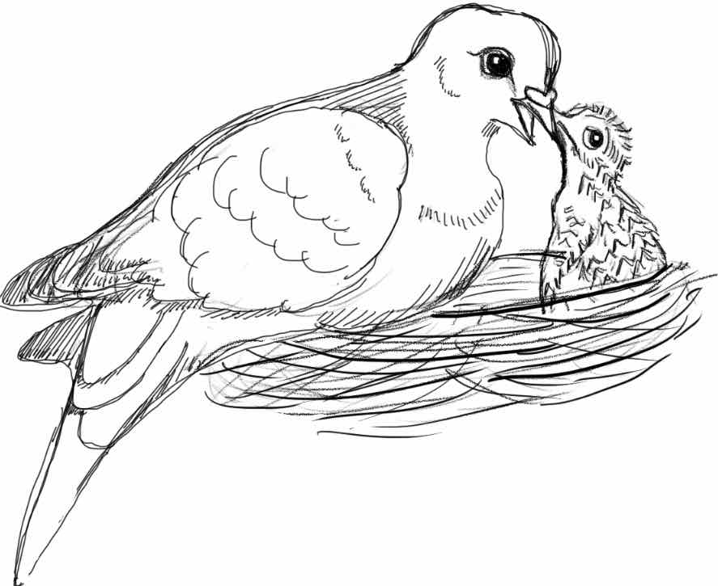
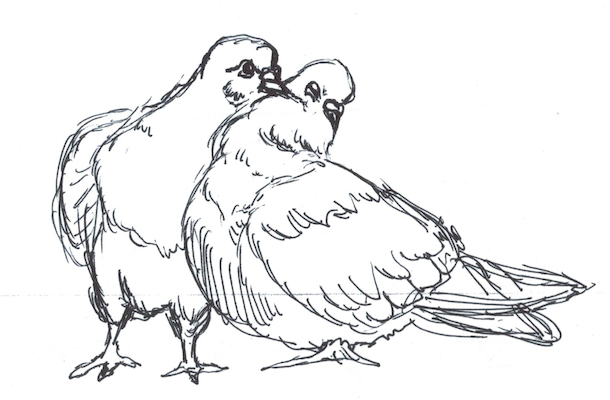

### How do endocrine axes, like reproduction and the stress response, shift as animals become parents? {#custom}

The transition into parenthood requires dynamic coordination of behavior and physiology to facilitate offspring care. How do endocrine axes, such as the reproductive hypothalamus-pituitary-gonadal (HPG) and the hypothalamic-pituitary-adrenal (HPA) axis, which coordinates the glucocorticoid “stress response” also change as animals enter a parental state?

Specifically, I focus on the pleiotropic effects of prolactin, a peptide known to drive and maintain parental care across vertebrates. Currently, I use hormone manipulations to get at the causal effects of prolactin on reproductive behaviors, HPG gene expression, and the stress response. We use the rock dove (aka the common pigeon, *Columba livia* as a model). 

:::: {style="display: flex;"}

::: {}
[{ width=300px height=250px}]()
:::

::: {}
**Presentations:**

Animal Behavior Society, July 2020, virtual. Talk. 

Animal Behavior Graduate Group seminar series, February 2020, Davis, CA. Talk. 

Society for Integrative and Comparative Biology, January 2020, Austin, TX. Talk. 

Society for Neuroscience, October 2019, Chicago, IL. Poster. 
:::

::::

### How does expression of prolactin and its receptor vary between the sexes and across tissues during parental care?

Using both transcriptomic and quantitative PCR datasets, I am taking a comprehensive view of how expression of prolactin and its receptor change across the HPG, crop sac, and spleen of male and female rock doves during various stages of parental care. 

This will shed light on where prolactin sensitivity may change and when as animals become parents, and generate hypotheses as to the function of prolactin expression beyond the pituitary. 

Currently in prep. for *Frontiers in Neuroendocrinology*.

:::: {style="display: flex;"}

::: {}
**Presentations:**

Society for Neuroscience, November 2018, San Diego, CA. Poster.  

Society for Integrative and Comparative Biology, 2018, San Francisco, CA. Poster
:::

::: {}
[{ width=300px height=205px}]()
:::

::::

