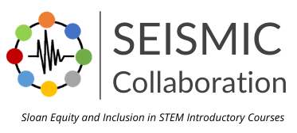

In addition to my dissertation research, I participate in **discipline-based education research**, specifically in biology and physiology, with Dr. Natalia Caporale. 

## SEISMIC Initiative : Measurements Projects

As a [SEISMIC Measurements Summer fellow](https://www.seismicproject.org/working-groups/measurement/2021-measurement-fellowship/), I extended our analysis of performance gaps to multiple upper-division courses across UC Davis. We are now actively collaborating to investigate these patterns across multiple institutions in the SEISMIC collaboration. 

Learn more about the Measurements working groups [here](https://www.seismicproject.org/working-groups/measurement/). 

{width=200px height=100px}

**Presentations:**

* SABER West, January 2023, Irvine, CA. Talk.

## Performance gaps in upper-division physiology
Combining 10 years of course performance data and student attitude surveys, we are examining how equity gaps affect performance in a core biomedical physiology course, and how student attitudes may influence these gaps. By characterizing these issues, we hope to explore opportunities for future interventions in course structure or assignments. 

**Publications:**

Farrar et al. *In revision*. *CBE-Life Sciences Education* 

**Presentations:**

* SABER West, January 2021, online, talk. 

* Society for the Advancement of Biology Education Research (SABER), July 2020, online, poster. 
