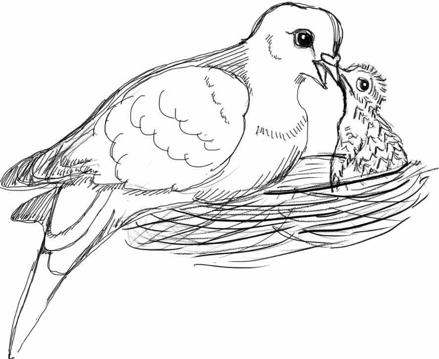

### How do endocrine axes, like reproduction and the stress response, shift as animals become parents? {#custom}

The transition into parenthood requires dynamic coordination of behavior and physiology to facilitate offspring care. How do endocrine axes, such as the reproductive hypothalamus-pituitary-gonadal (HPG) and the hypothalamic-pituitary-adrenal (HPA) axis, which coordinates the glucocorticoid “stress response” also change as animals enter a parental state?

Specifically, I focus on the pleiotropic effects of prolactin, a peptide known to drive and maintain parental care across vertebrates. Currently, I use hormone manipulations to get at the causal effects of prolactin on reproductive behaviors, HPG gene expression, and the stress response. We use the rock dove (*Columba livia*, a.k.a. the common pigeon) as a model. 

:::: {style="display: flex;"}

::: {}
[{ width=300px height=250px}]()
:::

::: {}
**Publications:**

Farrar et al., submitted to *Hormones and Behavior*. [Preprint on bioRxiv](https://www.biorxiv.org/content/10.1101/2021.12.13.472470v1.full.pdf)

**Presentations:**

Society of Integrative and Comparative Biology (SICB), January 2021, online. [Watch talk here](https://sicbannualmeeting.pathable.co/meetings/virtual/P2uFYrzEWfQykX4Aa) (*registration required*)

Animal Behavior Society, July 2020, online. Talk. 

Animal Behavior Graduate Group seminar series, February 2020, Davis, CA. Talk. 

SICB, January 2020, Austin, TX. Talk. 

Society for Neuroscience, October 2019, Chicago, IL. Poster. 

**Funding:**

American Ornithological Society Van Tyne Research Award, 2019. 
[{ width=132px height=38px}](https://americanornithology.org/awards-grants/)
:::

::::

### How does gaining parental experience affect prolactin regulation in the brain?

Animals who have had parental experience tend to show a more rapid and stronger behavioral response to offspring cues, which may facilitate the increased reproductive success seen in experienced parents.  Changes in prolactin regulation may mechanistically underlie these effects. I'm studying how varying levels of parental experience, while controlling for age, affect the brain and pitutiary's responsiveness to prolactin and VIP. 

**Funding:**

Animal Behavior Society Student Research Grant, 2021. 
{width=50px height=50px}

SICB Grant-in-Aid-of-Research (GIAR), 2021. 
{width=50px height=50px}

### How does expression of prolactin and its receptor vary between the sexes and across tissues during parental care?

Using both transcriptomic and quantitative PCR datasets, I am taking a comprehensive view of how expression of prolactin and its receptor change across the HPG, crop sac, and spleen of male and female rock doves during various stages of parental care. 

This will shed light on where prolactin sensitivity may change and when as animals become parents, and generate hypotheses as to the function of prolactin expression beyond the pituitary. 

:::: {style="display: flex;"}

::: {}
**Publications:**

Farrar et al., (2022). *General and Comparative Endocrinology*. [Open access article](https://www.sciencedirect.com/science/article/pii/S0016648021002331)

**Presentations:**

Society for Neuroscience, November 2018, San Diego, CA. Poster.  

Society of Integrative and Comparative Biology (SICB), 2018, San Francisco, CA. Poster
:::

::: {}
[{ width=300px height=205px}]()
:::

::::

[*Sketches by VSF*]{style="float:right"}
