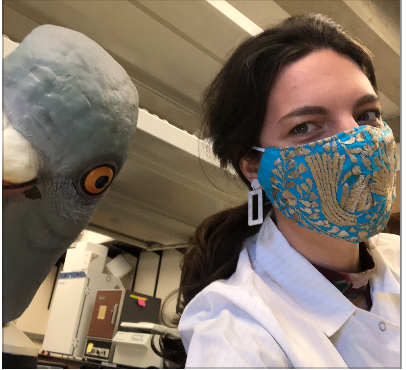

I am a Ph.D. candidate in Animal Behavior at the University of California Davis, working with Dr. Rebecca Calisi Rodríguez. 

My research investigates the physiological mechanisms of animal behavior, with a current focus on the neuroendocrine basis of reproduction and stress responses during parental care. 

Learn more about my research [here.](https://vsfarrar.github.io/dissertation-research.html)

:::: {style="display: flex;"}

::: {}
[{ width=203px height=185px}](http://calisilab.ucdavis.edu/people.html)
:::

::: {}
Follow me on: 

* [Github](https://github.com/vsfarrar)

* [Twitter](https://twitter.com/vs_farrar)

* [Google Scholar](https://scholar.google.com/citations?user=WS8oHRYAAAAJ&hl=en)
:::

::::

### Latest Updates

* Ph.D. chapters are coming out! The latest, looking at the causal effects of prolactin on mating and parental behaviors and HPG gene expression, is up on bioRxiv [here](https://www.biorxiv.org/content/10.1101/2021.12.13.472470v1.full.pdf).

* Our paper on prolactin and its receptor across the HPG axis during parental care is out now in *General and Comparative Endocrinology* ! Read it at the [open access link here](https://www.sciencedirect.com/science/article/pii/S0016648021002331). 

