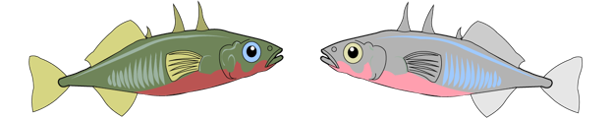

I plan to study the neural and physiological changes associated with the recent loss of parental care in a population of three-spined stickleback (*Gasterosteus aculeatus*), a species which typically shows paternal care for young. 

I plan to integrate across hormones and tissues I studied in my dissertation, such as prolactin and the effects on gonadal regulation. Stay tuned! 

:::: {style="display: flex;"}

::: {}
{width=450px height=100px}
:::

::: {}
{width=100px height=100px}
:::

::::